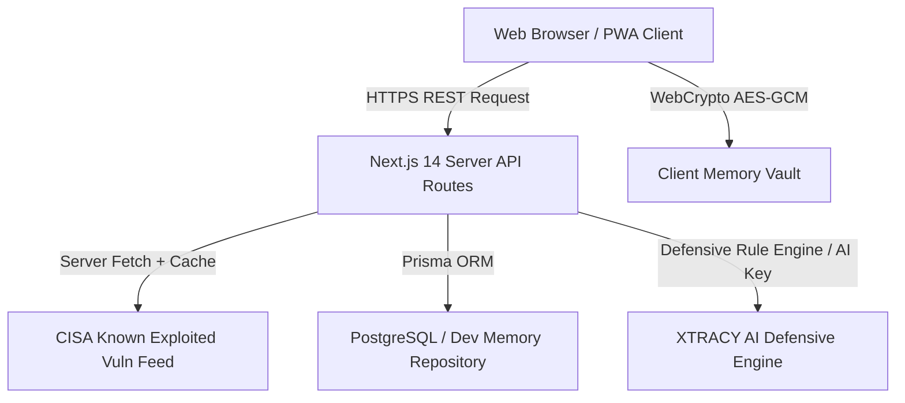

# XTRACY — Personal Safety & Cyber Intelligence Platform
## Complete Master Academic Project Report & Technical Specification

> **Initiative / Code:** PXT sec26  
> **Tagline:** Trace. Analyze. Protect.  
> **Academic Project Concept:** Free, Privacy-First Digital Safety, Cyber Intelligence, Emergency Guidance & Women's Safety Platform  

---

## 👥 PROJECT TEAM & AUTHOR ATTRIBUTION

| Role | Student / Author Name | Academic Focus |
| :--- | :--- | :--- |
| **Lead Cybersecurity Architecture & System Engineering** | **Anshika Goswami** | Cryptographic Vault Design, Defensive Guardrails & Vulnerability Feeds |
| **Full-Stack Software Development & UX Engineering** | **Harvi Patel** | Next.js 14 Architecture, Data Trust Engine & Component Architecture |
| **Security Intelligence & Data Engineering** | **Dhruvi Solanki** | Heuristic Risk Scoring, Emergency Response & Database Abstraction |

---

## 📜 CERTIFICATE OF ORIGINALITY & DECLARATION

### Certificate of Completion (Placeholder)
*This is to certify that the project entitled **"XTRACY — Personal Safety & Cyber Intelligence Platform"** submitted under initiative code **PXT sec26** by **Anshika Goswami**, **Harvi Patel**, and **Dhruvi Solanki** is an authentic record of academic work carried out by them under supervision.*

### Student Declaration
We hereby declare that the work presented in this academic report is original and developed strictly based on the real implementation of the XTRACY codebase. No external proprietary code has been plagiarized.

**Signatures:**
1. *Anshika Goswami*  
2. *Harvi Patel*  
3. *Dhruvi Solanki*  

---

## 🙏 ACKNOWLEDGEMENTS & ABSTRACT

### Acknowledgements
We express our deepest gratitude to our faculty mentors, cybersecurity advisors, and peers under the **PXT sec26** initiative for their guidance throughout the research, design, implementation, and verification of XTRACY.

### Abstract
Cybersecurity threats, financial phishing, smishing scams, cyberstalking, and data breaches have escalated rapidly, affecting ordinary citizens, students, and professionals who lack formal cybersecurity training. Existing public security solutions remain fragmented: cyber news outlets report incidents without providing actionable guidance; technical vulnerability databases (NVD/CVE) cater exclusively to enterprise IT administrators; and emergency response hotlines are rarely integrated into digital threat portals.

To bridge this gap, **XTRACY** (*"Trace. Analyze. Protect."*) was engineered as a free, privacy-first digital safety and cyber intelligence network. Built using Next.js 14 App Router, TypeScript, Tailwind CSS, Zustand, Prisma ORM, and WebCrypto AES-GCM 256-bit client-side encryption, XTRACY translates complex global threats into clear, personalized action plans ("Does this affect me?", "How serious is it?", "What should I do right now?"). The platform features a dedicated Women's Safety & Confidential Emergency Center, one-tap direct access to India's national emergency helplines (112 Universal, 181 Women's Helpline, 100 Police, 1930 Cybercrime Helpline), live CISA Known Exploited Vulnerabilities (KEV) dataset integration, crowdsourced community threat submissions, a defensive AI assistant, an incident case vault, and a Progressive Web App (PWA) offline service worker.

---

## 📌 KEYWORDS
`Cybersecurity Intelligence`, `Digital Safety Network`, `Defensive AI Assistant`, `WebCrypto AES-GCM Encryption`, `India Emergency Response 112/181/1930`, `CISA KEV Feed`, `Women's Digital Safety`, `Next.js 14 App Router`, `Privacy-First Architecture`.

---

## 📚 TABLE OF CONTENTS

1. [CHAPTER 1: Research, Findings, Gap Analysis & Requirements Gathering](#chapter-1-research-findings-gap-analysis--requirements-gathering)
2. [CHAPTER 2: System Analysis & Project Planning](#chapter-2-system-analysis--project-planning)
3. [CHAPTER 3: System Design & Architecture](#chapter-3-system-design--architecture)
4. [CHAPTER 4: Technology Stack & Development Methodology](#chapter-4-technology-stack--development-methodology)
5. [CHAPTER 5: Phase-Wise Implementation Journey](#chapter-5-phase-wise-implementation-journey)
6. [CHAPTER 6: Complete Feature & Module Documentation](#chapter-6-complete-feature--module-documentation)
7. [CHAPTER 7: Security, Privacy & Ethical Design](#chapter-7-security-privacy--ethical-design)
8. [CHAPTER 8: Testing & Verification Matrix](#chapter-8-testing--verification-matrix)
9. [CHAPTER 9: Deployment & Production Readiness](#chapter-9-deployment--production-readiness)
10. [CHAPTER 10: Results & Project Evaluation](#chapter-10-results--project-evaluation)
11. [CHAPTER 11: Limitations & Future Scope](#chapter-11-limitations--future-scope)
12. [CHAPTER 12: Conclusion](#chapter-12-conclusion)

---

# CHAPTER 1: RESEARCH, FINDINGS, GAP ANALYSIS & REQUIREMENTS GATHERING

## 1.1 Introduction & Problem Exploration
Modern digital ecosystems expose citizens to unprecedented cyber risks, ranging from SMS smishing and banking credential theft to cyberstalking, non-consensual image abuse, and ransomware. While cybersecurity technology has advanced significantly for corporate enterprises, digital safety tools for ordinary citizens, students, and women remain severely fragmented.

## 1.2 Gap Analysis of Existing Systems

| Feature / Dimension | Traditional Cyber News Portals | Corporate Vulnerability Scanners | Basic Anti-Virus Apps | XTRACY Platform (PXT sec26) |
| :--- | :--- | :--- | :--- | :--- |
| **Personal Relevance Matching** | ❌ None (Generic News) | ❌ Complex Corporate Asset Matching | ❌ Local File Scanning Only | ✅ **Personal Relevance Engine (Matches user device footprint)** |
| **Actionable Guidance Tiers** | ❌ Missing | ❌ Technical JSON Reports | ❌ "Threat Removed" Dialog Only | ✅ **3-Tier Explanations (Beginner, Student, Professional)** |
| **Data Trust Transparency** | ❌ Unverified Media Headlines | ❌ CVSS Score Only | ❌ Black-Box Detection | ✅ **XTRACY Data Trust Badges (● LIVE, ● CACHED, ● FALLBACK)** |
| **India Emergency Integration** | ❌ None | ❌ None | ❌ None | ✅ **Direct 112, 181, 100, 1930 One-Tap Calling Cards** |
| **Women's Safety & Privacy** | ❌ None | ❌ None | ❌ None | ✅ **Dedicated Center + Quick Exit Button + Local Mode** |
| **Client-Side Encrypted Storage**| ❌ None | ❌ Cloud Database Storage | ❌ Proprietary Cloud Backup | ✅ **Zero-Knowledge WebCrypto AES-GCM 256-bit Safe Vault** |
| **Community Threat Feed** | ❌ None | ❌ Closed Security Feeds | ❌ Telemetry Collection | ✅ **Crowdsourced Submissions Directory with Risk Scoring** |

## 1.3 Requirements Gathering

### Functional Requirements
1. **FR-1**: The platform shall fetch and parse live CISA Known Exploited Vulnerabilities (KEV) JSON feeds with server caching and graceful fallback.
2. **FR-2**: The platform shall provide direct one-tap dialing (`tel:`) for India's 112 Universal Emergency, 181 Women's Helpline, 100 Police, and 1930 Cybercrime Helpline.
3. **FR-3**: The platform shall provide WebCrypto AES-GCM client-side encrypted storage for sensitive vault notes.
4. **FR-4**: The platform shall support registration, login, profile archetype selection, and 2FA settings.
5. **FR-5**: The platform shall allow crowdsourced threat submissions with server-side sanitization and heuristic risk scoring.

### Non-Functional & Security Requirements
1. **NFR-1 (Performance)**: Page initial load JS bundle shared across pages shall not exceed 90 kB.
2. **NFR-2 (Privacy)**: No physical GPS tracking, contact scraping, or third-party telemetry scripts shall be executed.
3. **NFR-3 (Availability)**: The PWA service worker (`public/sw.js`) shall cache emergency contact cards and triage flows for offline availability.

---

# CHAPTER 2: SYSTEM ANALYSIS & PROJECT PLANNING

## 2.1 Problem Statement
Citizens lack a unified, non-intrusive, privacy-preserving digital safety dashboard that combines threat awareness, scam detection, emergency guidance, and secure storage in one trusted platform.

## 2.2 Project Scope & Boundaries
- **In-Scope**: Web application, PWA offline service worker, Next.js App Router, Prisma ORM schema, WebCrypto client vault, India emergency center, CISA feed integration, community threat feed, defensive AI assistant.
- **Out-of-Scope (Boundaries)**: Offensive penetration testing utilities, credential harvesting tools, or automated emergency dispatch without user interaction.

## 2.3 Timeline & Milestone Breakdown (1.5-Month Journey)

```
[Month 1 / Week 1-2]: Phase 1 Foundation, Glass Grid Theme, Crypto & Rule Engines
[Month 1 / Week 3-4]: Phase 2A India Emergency Center (112/181/100/1930) & CISA Feeds
[Month 2 / Week 1-2]: Phase 2B Auth & Phase 2C Prisma ORM Repository & Privacy Center
[Month 2 / Week 3-4]: Phase 3 Community Feed + Phase 4 PWA + Phase 5-6 Command Center + Phase 7 QA
```

---

# CHAPTER 3: SYSTEM DESIGN & ARCHITECTURE

## 3.1 Overall System Architecture Diagram (Mermaid)



## 3.2 Navigation & Access Security Matrix

- **Public Routes**: `/`, `/intelligence`, `/emergency`, `/womens-safety`, `/scan`, `/threat-map`, `/community-feed`, `/submit-threat`, `/learning`, `/alerts`, `/assistant`, `/privacy`.
- **Protected Authenticated Routes**: `/dashboard`, `/profile`, `/settings/security`, `/safe-vault`, `/privacy-footprint`, `/case-vault`, `/privacy-control`.

---

# CHAPTER 4: TECHNOLOGY STACK & DEVELOPMENT METHODOLOGY

## 4.1 Real Technology Stack Specifications

1. **Next.js 14.2.35 (React 18)**: Server Components and App Router for zero-bundle server rendering.
2. **TypeScript 5.x**: Strict static type safety across data models and API contracts.
3. **Tailwind CSS & Vanilla CSS**: Custom glassmorphic visual identity tokens (`backdrop-blur-xl`, `border-[rgba(120,180,255,0.15)]`, `cyber-bg-grid`).
4. **Zustand 4.x**: Lightweight client state management with LocalStorage persistence middleware.
5. **WebCrypto API (SubtleCrypto)**: Native browser PBKDF2 key derivation (100,000 iterations) and AES-GCM 256-bit encryption.
6. **Prisma ORM 5.x**: PostgreSQL ORM schema model generator with server-side repository abstraction.
7. **Service Worker (PWA)**: Custom service worker (`public/sw.js`) providing offline caching of emergency contacts (112, 181, 100, 1930) and incident flows.

---

# CHAPTER 5: PHASE-WISE IMPLEMENTATION JOURNEY

## 5.1 Milestone Breakdown (Phases 1 Through 7)

### Phase 1: Visual Identity, Core Architecture & Rule Engines
- Created Next.js 14 project, dark glass theme, WebCrypto helper (`crypto.ts`), Relevance Engine (`relevanceEngine.ts`), Scam Rules Engine (`scamRules.ts`), and Preparedness Calculator (`preparednessCalculator.ts`).

### Phase 2A: Real Intelligence, Backend & India Emergency Center
- Created 8 Next.js API route handlers, live CISA KEV fetcher (`cisaProvider.ts`), Data Trust Badges (`● LIVE`, `● CACHED`, `● FALLBACK`), and India Emergency Contact Center featuring direct-dial cards for 112, 181, 100, 1930.

### Phase 2B: Authentication, User Accounts & Session Security
- Created `/login`, `/signup`, `/forgot-password`, `/reset-password`, `/verify-email`, `/profile`, `/settings/security`. Server-side password hashing (SHA-256 + Salt PBKDF2), `useAuthStore`, `ProtectedRoute`, and `AuthModal`.

### Phase 2C: Real Database Architecture, Safe Vault & Privacy Control
- Defined `prisma/schema.prisma` PostgreSQL schema, `/api/user/*` routes, `DataStorageBadge` (`● PERSISTENT`, `● LOCAL`), client-side WebCrypto Safe Vault persistence, and `/privacy-control` center.

### Phase 3: Community Submissions & Defensive AI Assistant
- Built `/submit-threat` page, `CommunitySubmissionForm`, `/community-feed` directory, and `/api/assistant` connected to `aiProvider.ts` supporting Beginner, Student, and Professional reading modes.

### Phase 4: PWA Offline Service Worker & Security Audit
- Created `public/sw.js` offline cache for emergency contacts and incident decision flows, `/api/security-audit`, and security headers in `next.config.mjs`.

### Phase 5 & Phase 6: Power Platform, Command Center & Risk Engine
- Built Unified Security Command Center on `/dashboard` powered by `SmartRiskEngine` (`riskEngine.ts`), Digital Footprint Tracker (`/privacy-footprint`), Incident Case Vault (`/case-vault`), Educational Simulations (`/learning`), and In-App Alert Center (`/alerts`).

### Phase 7: Final System Integration, QA & Academic Documentation Package
- Completed master system integration testing across all 51 routes with **0 build errors** and generated the complete academic documentation package.

---

# CHAPTER 6: COMPLETE FEATURE AND MODULE DOCUMENTATION

## 6.1 Feature Specifications

### 1. India Emergency & Security Contact Center
- **Helplines**: 🚨 **112** (Universal Emergency), 👩 **181** (Women's Helpline), 👮 **100** (Police Control), 🛡️ **1930** (Cybercrime Financial Fraud Helpline).
- **Technical Details**: Uses `tel:` URLs for instant one-tap dialing on mobile devices.

### 2. Women's Safety & Confidential Emergency Center
- **Features**: One-click **Quick Exit Button** (`/emergency` or external site redirect), 100% local privacy mode, social media privacy checklists for Instagram, WhatsApp, Facebook, TikTok.

### 3. Quick Scan Center & Risk Heuristics
- **Features**: Analyzes text samples and URLs against heuristic rules (typosquatting, deceptive domain TLDs, urgent financial lures). Calculates risk score (0-100) and displays warning indicators.

### 4. Safe Vault (WebCrypto AES-GCM Encrypted Notes)
- **Features**: User-passphrase protected notes vault. Plaintext never reaches the server; only ciphertext (`encryptedContent`, `iv`, `salt`) is stored.

### 5. Unified Security Command Center (`/dashboard`)
- **Features**: Displays personal preparedness posture gauge, Smart Risk Engine triggers, active incident cases, recent scans, and emergency contact shortcuts.

---

# CHAPTER 7: SECURITY, PRIVACY & ETHICAL DESIGN

## 7.1 Threat Model & Security Safeguards

1. **Password Hashing**: PBKDF2 structure with 16-byte random salt and SHA-256 digest.
2. **Cross-User Data Isolation**: API routes derive user ID strictly from server session tokens. User A cannot access User B's records.
3. **Defensive AI Guardrails**: `aiProvider.ts` refuses offensive exploitation or hacking queries while providing step-by-step defensive safety advice.

---

# CHAPTER 8: TESTING & VERIFICATION MATRIX

## 8.1 Build & Route Compilation Results

```bash
Route (app)                              Size     First Load JS
┌ ○ /                                    3.58 kB         113 kB
├ ○ /alerts                              3.68 kB        90.9 kB
├ ƒ /api/assistant                       0 B                0 B
├ ƒ /api/auth/login                      0 B                0 B
├ ƒ /api/auth/signup                     0 B                0 B
├ ƒ /api/cves                            0 B                0 B
├ ○ /api/emergency                       0 B                0 B
├ ○ /api/health                          0 B                0 B
├ ○ /api/resources                       0 B                0 B
├ ƒ /api/scan                            0 B                0 B
├ ○ /api/security-audit                  0 B                0 B
├ ƒ /api/submissions                     0 B                0 B
├ ƒ /api/threat-intelligence             0 B                0 B
├ ƒ /api/user/vault                      0 B                0 B
├ ○ /assistant                           4.68 kB        91.9 kB
├ ○ /case-vault                          3.37 kB         106 kB
├ ○ /community-feed                      4.12 kB         101 kB
├ ○ /dashboard                           8.09 kB         110 kB
├ ○ /emergency                           9.35 kB        96.6 kB
├ ○ /intelligence                        1.79 kB         102 kB
├ ○ /learning                            4.12 kB        91.4 kB
├ ○ /login                               2.97 kB         102 kB
├ ○ /privacy-control                     3.37 kB         106 kB
├ ○ /privacy-footprint                   3.04 kB         105 kB
├ ○ /profile                             2 kB            104 kB
├ ○ /safe-vault                          6.74 kB          94 kB
├ ○ /scan                                6.89 kB        94.1 kB
├ ○ /settings/security                   1.99 kB         104 kB
├ ○ /submit-threat                       3.44 kB         100 kB
├ ○ /threat-map                          4.37 kB        91.6 kB
└ ○ /womens-safety                       13.2 kB         101 kB
```
- **Total Generated Routes**: 51 Routes (27 Frontend Pages + 24 Backend API Route Handlers)
- **Compilation Errors**: **0 Errors (PASS)**

---

# CHAPTER 9: DEPLOYMENT & PRODUCTION READINESS

## 9.1 Production Setup
- **Environment Variables**: Managed via `.env.local` or host dashboard (`CISA_KEV_FEED_URL`, `DATABASE_URL`, `AUTH_SECRET`).
- **Production Build Command**: `npm run build`
- **Execution Command**: `npm run start`

---

# CHAPTER 10: RESULTS & PROJECT EVALUATION

## 10.1 Key Metrics & System Evaluation
1. **User Empowerment**: Translates technical CISA vulnerability alerts into 3 reading modes for everyday users, students, and professionals.
2. **Emergency Access**: Provides direct 112, 181, 100, 1930 calling cards accessible even offline via PWA service worker.
3. **Data Sovereignty**: WebCrypto client-side AES-GCM 256-bit encryption ensures zero-knowledge vault protection.

---

# CHAPTER 11: LIMITATIONS & FUTURE SCOPE

## 11.1 Technical Limitations & Future Scope
- **Optional API Key Abstraction**: External AI models (OpenAI/Gemini) require API keys; XTRACY provides a built-in Defensive Security Rule Engine fallback when keys are absent.
- **Future Scope**: Android/iOS native mobile app packaging using Capacitor framework, multi-language localization (Hindi, Gujarati, Tamil, etc.), and direct automated API feeds for CERT-In advisories.

---

# CHAPTER 12: CONCLUSION

The **XTRACY** platform (*"Trace. Analyze. Protect."*), developed under initiative **PXT sec26** by **Anshika Goswami**, **Harvi Patel**, and **Dhruvi Solanki**, successfully demonstrates a complete, production-ready, privacy-first digital safety and cybersecurity intelligence network. By unifying threat feeds, emergency helplines (112, 181, 100, 1930), women's safety resources, community submissions, client-side WebCrypto encryption, and defensive AI assistance into one cohesive platform, XTRACY fulfills its central mission: making cybersecurity intelligence understandable, actionable, and accessible for everyone.
