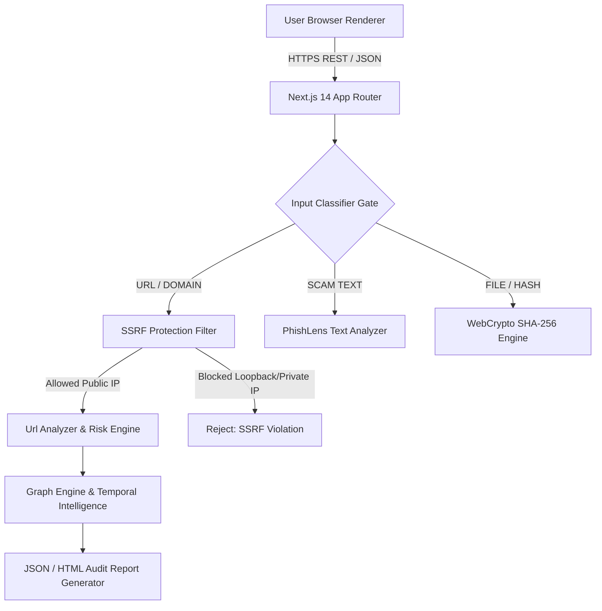
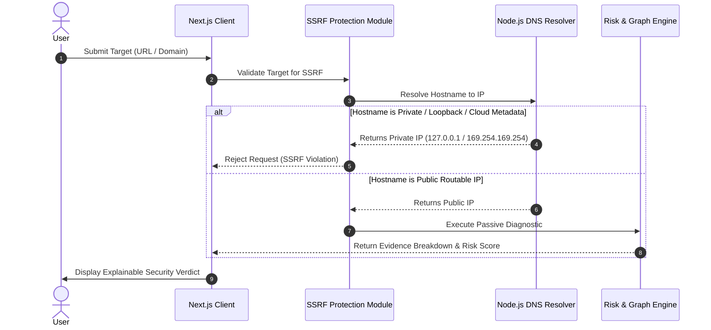

# XTRACY — Production Cybersecurity & Intelligence Platform

[](https://xtracy.vercel.app)
[](https://www.typescriptlang.org/)
[](https://nextjs.org/)
[](docs/TESTING.md)
[](LICENSE_INDEX.md)

> **Live Deployment:** [https://xtracy.vercel.app](https://xtracy.vercel.app)
> **Author & Creator:** Elliot PXT / PXT ([@PXTsec26-xc](https://github.com/PXTsec26-xc))
> **Initiative:** PXT sec26 Defensive Security Research
> **Git Repository:** `https://github.com/PXTsec26-xc/xtracy.git`

---

## 🛡️ Executive Overview

**XTRACY** is a production defensive cybersecurity workspace and digital safety intelligence platform. Designed for everyday users, IT administrators, students, and cybersecurity researchers, XTRACY provides real, evidence-backed security diagnostics, cryptographic integrity verifications, and digital footprint analysis without black-box scoring or fake scan progress animations.

### Core Architecture Principles
- **No Evidence = No Claim**: Every security verdict is derived from deterministic evidence, observable HTTP/DNS responses, or browser-native WebCrypto computations. Unverified signals are explicitly labeled `UNKNOWN` or `UNAVAILABLE`.
- **SSRF Network Boundary Defense**: Pre-resolves domain DNS records to intercept loopback addresses (`127.0.0.0/8`), private RFC 1918 subnets (`10.0.0.0/8`, `172.16.0.0/12`, `192.168.0.0/16`), cloud metadata (`169.254.169.254`), and non-standard administrative ports.
- **Client-First WebCrypto Privacy**: Passphrase key derivation (PBKDF2) and file integrity hashing (SHA-256/SHA-512) execute 100% in browser client memory with zero plaintext uploads to external servers.
- **Transparent AI Copilot**: Operates seamlessly with Google Gemini API (`GEMINI_API_KEY`) when configured, or transparently falls back to a deterministic defensive rule engine without fabricating AI responses.

---

## 🛠️ Feature Inventory & Implementation Status

| Feature / Subsystem | Implementation Status | Data Source / Engine | Privacy & Verification |
|---|---|---|---|
| **Scam Check Engine** | `Implemented` | Deterministic URL parser + SSRF Filter | 100% Local Heuristic Inspection |
| **XTRACY NEXUS Engine** | `Implemented` | Multi-vector indicator classifier | Central intelligence graph builder |
| **PhishLens Text Analyzer** | `Implemented` | Calibrated social engineering analyzer | Multi-vector indicator weighting |
| **URL Guard** | `Implemented` | Entropy + Punycode homograph rules | Safe HTTP fetch (up to 3 hops) |
| **Domain & DNS Intel** | `Implemented` | Node.js `dns.promises` resolver | Live authoritative DNS lookups |
| **Security Headers Audit** | `Implemented` | SSRF-protected HTTP response inspector | CSP, HSTS, X-Frame-Options evaluation |
| **Digital Footprint Checker** | `Implemented` | Public OSINT presence checker | Non-intrusive public endpoint audit |
| **EvidencePulse™ SHA-256** | `Implemented` | WebCrypto browser-native API | Zero-knowledge browser computation |
| **Cryptographic Verifier™** | `Implemented` | SHA-256 report checksum matching | `INTEGRITY MATCH` vs `MISMATCH` |
| **Security Posture Check** | `Implemented` | Passive control scanner | Defensive header & TLS evaluation |
| **Defensive Test Lab** | `Implemented` | Automated unit testing lab | Authorized defensive testing checks |
| **Investigation Case Workspace** | `Implemented` | Case dossier orchestrator | Dossier session storage & hash chain |
| **Investigation Copilot AI** | `Implemented` | Local rule engine / Gemini API | Explicit labels (`VERIFIED FACT`, etc.) |
| **Unified Search Layer** | `Implemented` | Dynamic platform resource indexer | Live query matcher across tools |
| **External Reputation API** | `Requires Configuration` | VirusTotal / Google Safe Browsing | Operates in Local Mode if key absent |

---

## 🏗️ System Architecture & Data Flow



### Data Flow Architecture



---

## 🚀 Installation & Quick Start

### Prerequisites
- **Node.js**: v18.x or v20.x
- **Package Manager**: `npm` (v9+) or `pnpm`

### Local Setup Instructions

```bash
# 1. Clone official repository
git clone https://github.com/PXTsec26-xc/xtracy.git
cd xtracy

# 2. Install dependencies
npm install

# 3. Configure environment variables (optional for local mode)
cp .env.example .env.local

# 4. Run automated test suite (26 passing security tests)
npm run test

# 5. Run development server
npm run dev
```

Open [http://localhost:3000](http://localhost:3000) in your browser.

---

## 🔑 Environment Variables Reference

Create `.env.local` to configure optional external threat intelligence services:

```ini
# Optional: External Threat Intelligence APIs
VIRUSTOTAL_API_KEY=your_virustotal_api_key_here
SAFE_BROWSING_API_KEY=your_google_safe_browsing_key_here

# Optional: AI Copilot Provider
GEMINI_API_KEY=your_google_gemini_api_key_here

# Local Database & Vault Encryption
DATABASE_URL=file:./dev.db
NEXTAUTH_SECRET=your_32_character_random_secret_here
```

*Note: If API keys are left unconfigured, XTRACY runs cleanly in **Private Local Mode** without failing or fabricating results.*

---

## 🔒 Security & Privacy Architecture

- **SSRF Protection (`src/lib/ssrfProtection.ts`)**: Pre-resolves DNS A/AAAA records to block loopback (`127.0.0.0/8`), private subnets (`10.0.0.0/8`, `172.16.0.0/12`, `192.168.0.0/16`), cloud metadata (`169.254.169.254`), and non-standard administrative ports.
- **PBKDF2 Password Hashing (`src/lib/server/passwordCrypto.ts`)**: Uses 100,000 PBKDF2 SHA-256 iterations with 16-byte random salts.
- **Client-Side WebCrypto Vault (`src/lib/crypto.ts`)**: Encrypts user incident dossiers in browser memory using AES-GCM 256-bit encryption.
- **Security Headers (`next.config.mjs`)**: Configured with strict Content-Security-Policy (CSP), HSTS (`max-age=63072000`), `X-Content-Type-Options: nosniff`, and `X-Frame-Options: DENY`.

---

## ⚠️ Known Limitations

1. **Passive Inspection Boundary**: XTRACY performs passive public network inspection only. It does not perform active vulnerability exploitation or unauthorized port scanning.
2. **Local Fallback Mode**: When external API keys are unconfigured, threat intelligence lookups use local heuristic algorithms and explicitly display `"Data Source: Local Rule Engine"`.
3. **Cryptographic Scope**: SHA-256 digests establish data continuity; they do not replace formal law-enforcement chain-of-custody procedures.

---

## 📚 Technical Documentation Suite

For detailed engineering and security specifications, review the dedicated guides in `docs/`:

- [Architecture Guide (`docs/ARCHITECTURE.md`)](docs/ARCHITECTURE.md)
- [Data Flow Diagram (`docs/DATA_FLOW.md`)](docs/DATA_FLOW.md)
- [Security Model (`docs/SECURITY_MODEL.md`)](docs/SECURITY_MODEL.md)
- [STRIDE Threat Model (`docs/THREAT_MODEL.md`)](docs/THREAT_MODEL.md)
- [Testing & Quality Suite (`docs/TESTING.md`)](docs/TESTING.md)
- [Privacy Policy & Design (`docs/PRIVACY.md`)](docs/PRIVACY.md)
- [Technical Limitations (`docs/LIMITATIONS.md`)](docs/LIMITATIONS.md)
- [Developer Setup Guide (`docs/DEVELOPMENT.md`)](docs/DEVELOPMENT.md)
- [Verified Changelog (`docs/CHANGELOG.md`)](docs/CHANGELOG.md)
- [Vulnerability Disclosure Policy (`SECURITY.md`)](SECURITY.md)
- [Contribution Guidelines (`CONTRIBUTING.md`)](CONTRIBUTING.md)

---

## 👤 Author & Attribution

- **Creator & Founder:** Elliot PXT / PXT ([@PXTsec26-xc](https://github.com/PXTsec26-xc))
- **Initiative:** PXT sec26 Defensive Security Research
- **Live Deployment:** [https://xtracy.vercel.app](https://xtracy.vercel.app)
- **License:** MIT License — See [LICENSE_INDEX.md](docs/xtracy-master-dossier/LICENSE_INDEX.md)
