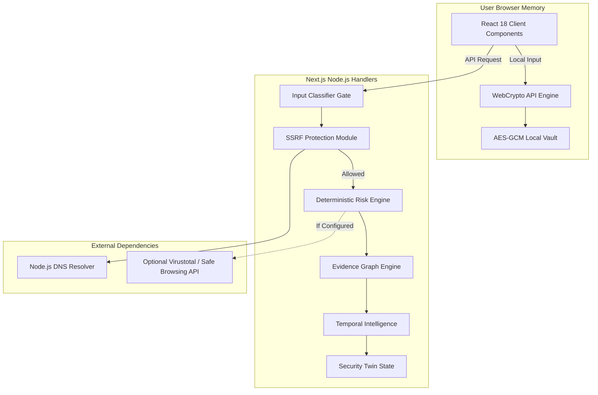

# XTRACY Architecture & Engineering Guide

**Target Release**: `v2.1 Final Ascension`
**Framework**: Next.js 14.2.35 (React 18, TypeScript 5.5)
**Author**: Elliot PXT / PXT ([@PXTsec26-xc](https://github.com/PXTsec26-xc))

---

## 1. High-Level Architecture Overview

XTRACY is built on Next.js App Router architecture, using a hybrid client-server model that strictly segregates client-side zero-knowledge cryptographic processing from server-side SSRF-protected network analysis.

---

## 2. Core Architectural Components

### 2.1 Input Classifier Gate (`src/lib/server/inputClassifier.ts`)
Before any network analysis is executed, user input passes through a strict 5-category classifier gate:
- `VALID_URL`: Protocol scheme explicitly starts with `http://` or `https://`.
- `VALID_DOMAIN`: Domain string matches RFC 1035 domain specifications.
- `VALID_IP`: IPv4 / IPv6 addresses.
- `INVALID_INPUT`: Malformed strings, empty inputs, non-routable schemes (`javascript:`, `file:`, `data:`). Returns `HTTP 400 Bad Request`.
- `RESTRICTED_TARGET`: Reserved RFC 2606 test domains (`.example`, `.test`, `.invalid`, `.localhost`).

### 2.2 SSRF Protection Pipeline (`src/lib/ssrfProtection.ts`)
To protect against Server-Side Request Forgery (SSRF) and DNS rebinding attacks, all URL inspection handlers pre-resolve hostnames via Node.js `dns.promises.lookup` and verify resolved IPs against private/loopback/metadata blocklists:
- **Loopback**: `127.0.0.0/8`, `::1`
- **Private Subnets**: `10.0.0.0/8`, `172.16.0.0/12`, `192.168.0.0/16`
- **Link-Local / Cloud Metadata**: `169.254.169.254` (AWS/GCP/Azure)
- **Carrier-Grade NAT**: `100.64.0.0/10`
- **Non-Standard Ports**: Allowed HTTP/HTTPS ports only (`80`, `443`, `8080`, `8443`).

### 2.3 Evidence Graph Engine (`src/lib/server/graphEngine.ts`)
Constructs verifiable entity-relationship graphs where every node (`DOMAIN`, `URL`, `IP`, `CERTIFICATE`, `FINDING`) and edge (`RESOLVES_TO`, `HOSTED_ON`, `OBSERVED_IN`, `SUPPORTS`, `CONTRADICTS`) is bound to explicit observable evidence.

### 2.4 Temporal Intelligence (`src/lib/server/temporalEngine.ts`)
Tracks state evolution over time, categorizing timeline events strictly into:
- `FACT`: Direct observable data (e.g. DNS A-record lookup).
- `OBSERVATION`: Detected header attribute or TLS parameter.
- `INFERENCE`: Risk indicator derived from heuristic scoring logic.
- `RECOMMENDATION`: Suggested defensive remediation step.

### 2.5 Server-Side Password Cryptography (`src/lib/server/passwordCrypto.ts`)
Hashes passwords using PBKDF2 with SHA-256 (100,000 iterations) and a 16-byte cryptographically random salt per user credential.

---

## 3. Technology Stack & Verification Matrix

| Tier | Technology | Version | Purpose |
|---|---|---|---|
| **Framework** | Next.js | `14.2.35` | Full-stack SSR framework & App Router handlers |
| **Frontend** | React / Tailwind CSS | `18.3.1` / `3.4.10` | Responsive glassmorphism interface |
| **Type System** | TypeScript | `5.5.4` | Strict static analysis |
| **Client Cryptography** | WebCrypto API | W3C Native | AES-GCM 256-bit vault & SHA-256 digests |
| **Server Cryptography** | Node.js `crypto` | Native Core | PBKDF2 password hashing (100,000 rounds) |
| **Database** | SQLite (`better-sqlite3`) | `9.4.3` | User accounts, saved incidents, and bookmarks |
