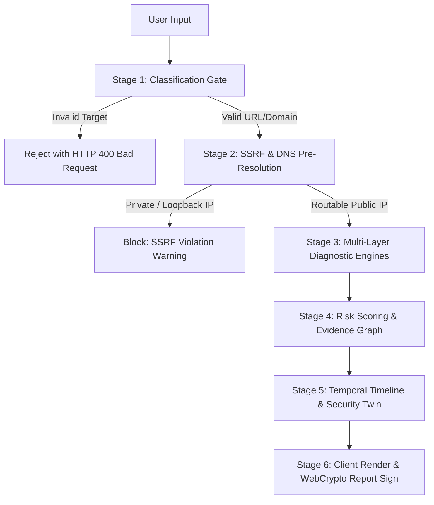

# XTRACY Data Flow Architecture

**Author**: Elliot PXT / PXT ([@PXTsec26-xc](https://github.com/PXTsec26-xc))
**Target Release**: `v2.1 Final Ascension`

---

## 1. End-to-End Analysis Pipeline

Information processed by XTRACY follows a 6-stage pipeline designed to enforce input sanitization, SSRF protection, deterministic analysis, and cryptographic evidence verification.

---

## 2. Detailed Data Flow Sequence

### 2.1 URL Inspection & Header Audit Flow
1. **Client Submission**: User submits target URL (`https://example.com`) via UI form.
2. **Input Gate Validation**: `classifyInput(target)` verifies protocol scheme and syntax.
3. **SSRF Pre-Resolution**: `validateUrlForSSRFAsync(target)` performs Node.js DNS pre-lookup.
   - If hostname resolves to `127.0.0.1`, `10.0.0.0/8`, `172.16.0.0/12`, `192.168.0.0/16`, or `169.254.169.254`, execution halts immediately.
4. **Diagnostic Execution**:
   - `urlAnalyzer.ts` evaluates Punycode, compound hyphens, TLD risk, and brand impersonation keywords.
   - `header-analyzer` executes SSRF-safe HTTP HEAD/GET request to evaluate `CSP`, `HSTS`, `X-Frame-Options`.
5. **Score Aggregation**: `riskEngine.ts` calculates a 0–100 evidence score.
6. **Graph & Temporal Binding**: `graphEngine.ts` binds findings to nodes and edges.
7. **Client Presentation**: Returns JSON response with `dataTrust` status.

### 2.2 Client-Side WebCrypto Zero-Knowledge Flow
1. **File Ingestion**: User selects file in `EvidencePulse` (`/evidencepulse`).
2. **Browser Execution**: `FileReader` streams binary file into browser memory.
3. **WebCrypto Digest**: `crypto.subtle.digest('SHA-256', buffer)` computes a 64-character hex hash natively inside user browser memory.
4. **Manifest Generation**: JCS (RFC 8785) canonicalization formats evidence metadata.
5. **Zero Upload**: Plaintext file content is **never sent** over network sockets.

---

## 3. Data Processing Summary Table

| Data Type | Ingestion Vector | Storage Location | Retention / Privacy |
|---|---|---|---|
| **Target URLs / Domains** | Scam Check / URL Guard | Ephemeral server memory | Not logged to third parties |
| **Evidence Files** | EvidencePulse | Client browser RAM | Zero server upload |
| **User Passwords** | Auth Signup / Login | SQLite Database | PBKDF2 SHA-256 (100k rounds) |
| **Incident Dossiers** | Safe Vault | Client LocalStorage / DB | AES-GCM 256-bit encrypted |
